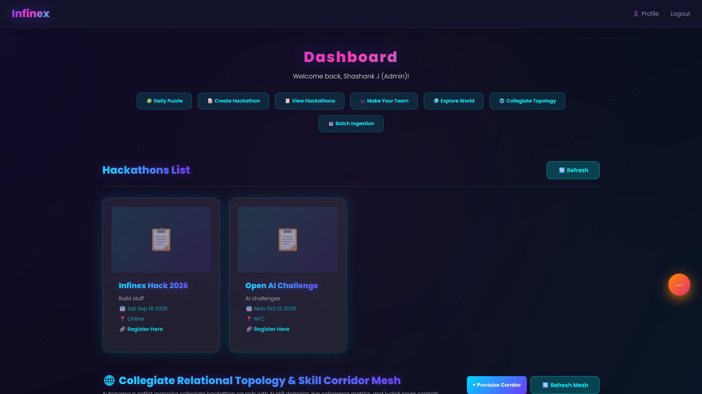
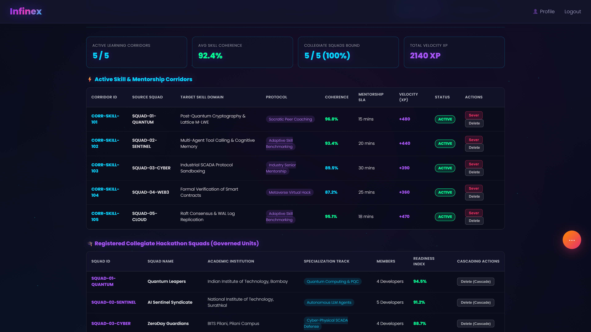
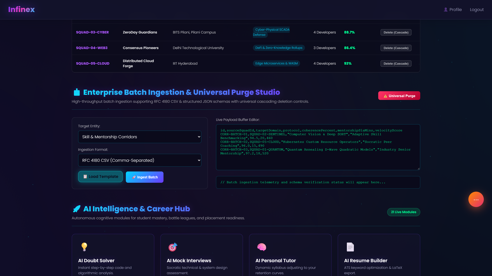
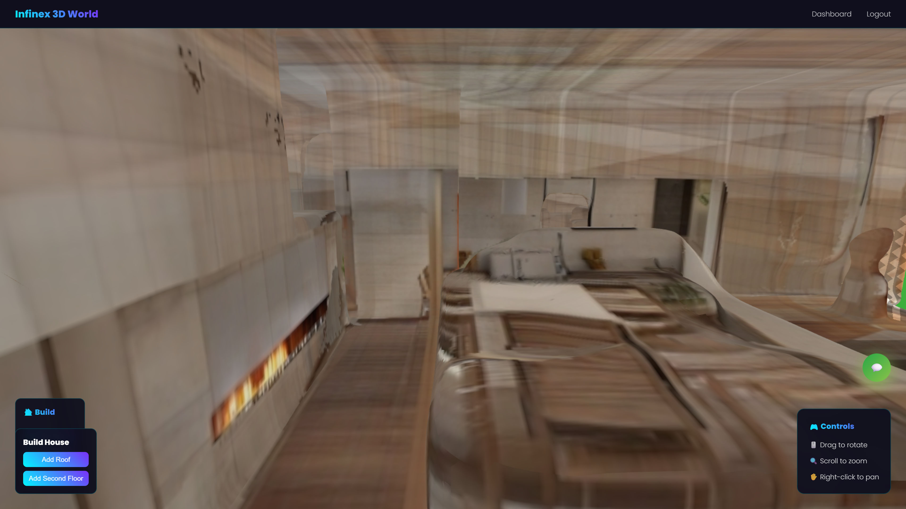
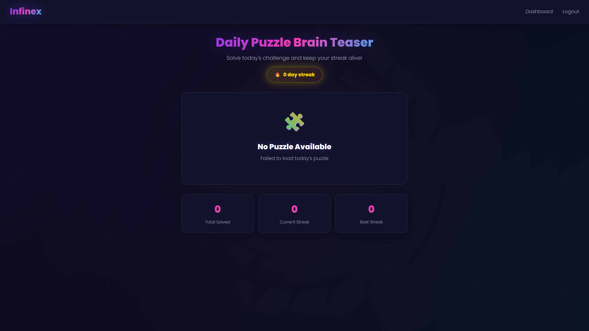
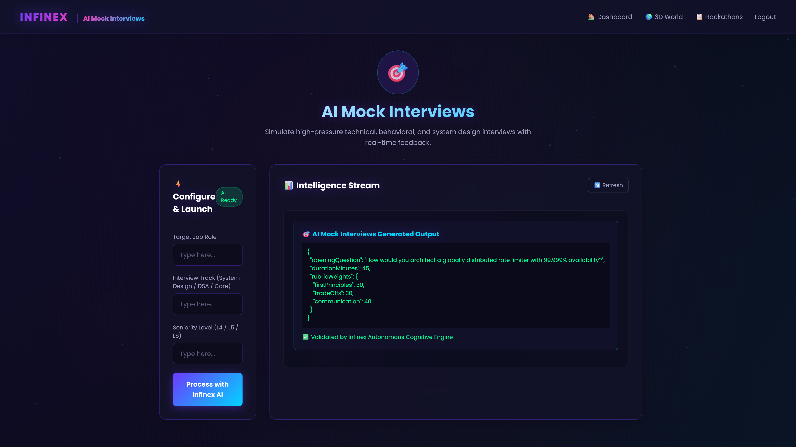

# 🚀 Infinex: Autonomous AI Learning & Campus Career Acceleration Platform

[](https://nodejs.org/)
[](https://expressjs.com/)
[](https://www.mongodb.com/)
[](https://threejs.org/)
[](#collegiate-relational-topology-mesh)
[](#automated-test-suite)

> **Enterprise Collegiate Operating System**: An all-in-one educational, career-readiness, and hackathon metaverse platform engineered for collegiate talent. Unifies real-time collaborative coding, 3D virtual campus worlds, collegiate relational learning corridors, high-throughput batch ingestion studio, Socratic AI tutors, and placement benchmarks.

---

## 📸 Enterprise Platform Showcase


### Desktop Command Viewports (1920×1080 @ 2x)

| Viewport | Description | Screenshot |
| :--- | :--- | :--- |
| **01. Executive Dashboard & Hackathons** | Central collegiate portal with live hackathons grid, team formation hub, and 21 autonomous AI module launchers |  |
| **02. Collegiate Topology Mesh** | Relational learning corridors mapping collegiate hackathon squads with skill domains, coherence ratings, and 1-click sever controls |  |
| **03. Batch Ingestion Studio** | High-throughput batch ingestion console supporting RFC 4180 CSV & structured JSON formats with universal cascading purge controls |  |
| **04. 3D Metaverse Campus World** | Interactive 3D Three.js WebGL virtual campus navigation with architectural modular building and spatial exploration |  |
| **05. Daily DSA Cognitive Arena** | Algorithmic daily puzzle arena with interactive code evaluation, cognitive streak tracking, and difficulty tiers |  |
| **06. AI Mock Interview Studio** | Socratic technical and system design mock interview studio with real-time competency evaluations and rubric feedback |  |

---

## ⚡ Core Enterprise Capabilities

### 1. Collegiate Relational Topology Mesh
- Autonomous netlist mapping collegiate hackathon squads (`SQUAD-01-QUANTUM`, `SQUAD-02-SENTINEL`, `SQUAD-03-CYBER`, `SQUAD-05-CLOUD`) with specialized engineering domains (*Post-Quantum Cryptography*, *Multi-Agent LLM Tool Calling*, *SCADA Protocol Sandboxing*, *Raft Consensus Log Replication*).
- Real-time telemetry monitoring skill coherence %, mentorship SLA targets (mins), velocity XP generation, and campus coverage percentage.
- **1-Click Sever Controls**: Instantaneous corridor severance and dynamic mentorship re-routing for active student cohorts.

### 2. Enterprise Batch Ingestion Studio
- High-throughput batch ingestion supporting both standard **RFC 4180 CSV** (with quoted multi-word strings and commas) and **Structured JSON**.
- Dual entity support: Collegiate Hackathon Squads and Skill/Mentorship Corridors.
- Interactive live buffer editor pre-loaded with production templates, line counters, and real-time schema validation feedback.

### 3. Universal Cascading Deletion
- Referential integrity enforcement: deleting a collegiate squad automatically cascades and eliminates all linked learning corridors.
- 1-click universal purge safeguard for reset and institutional re-allocation.

### 4. 21 Innovation Hub AI & Platform Routers
- **AI Doubt Solver**: Instant step-by-step code and algorithmic breakdown.
- **AI Mock Interviews**: Socratic system design and behavioral assessment.
- **AI Resume Builder & Placement Gap Analyzer**: AST resume scoring and company-tailored curriculum roadmaps.
- **College Battle Leagues & Peer Tutoring**: Inter-collegiate hack leagues and collaborative peer bounties.

---

## 🧪 Automated Test Suite

Infinex includes a comprehensive native Node.js automated test suite validating all enterprise topology services, cascading lifecycles, and batch schemas:

```bash
# Execute automated test suite
cd sup-backend
node --test tests/enterpriseMesh.test.js
```

### Verified Test Matrix (11/11 Passing):
- [x] Collegiate squad seeding & schema verification
- [x] Live telemetry calculation (Coherence, Coverage, Total Velocity XP)
- [x] Dynamic corridor provisioning & squad binding
- [x] 1-Click corridor severance & telemetry recalculation
- [x] Single corridor deletion & continuity check
- [x] Squad deletion with cascading corridor purge
- [x] High-throughput RFC 4180 CSV batch ingestion
- [x] Structured JSON batch ingestion
- [x] Malformed payload rejection & error reporting
- [x] Universal corridor purge
- [x] Universal squad & cascading corridor purge

---

## 🚀 Quickstart

```bash
# Clone repository
git clone https://github.com/Shashankcodelover/Infinex.git
cd Infinex/sup-backend

# Install dependencies
npm install

# Run automated tests
node --test tests/enterpriseMesh.test.js

# Launch backend server
node server.js
# Access dashboard at http://localhost:5000/dashboard/dashboard.html
```

---

## 📜 License
MIT License. Open-source educational and career acceleration platform.
